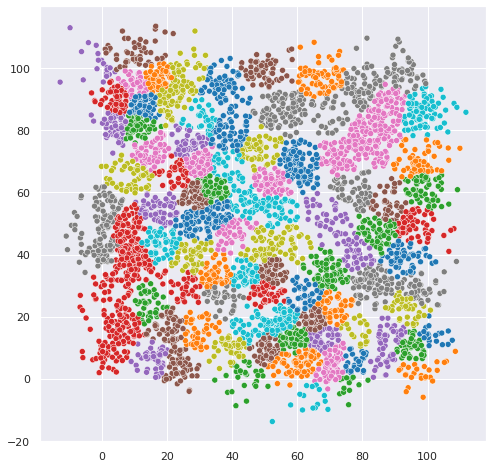
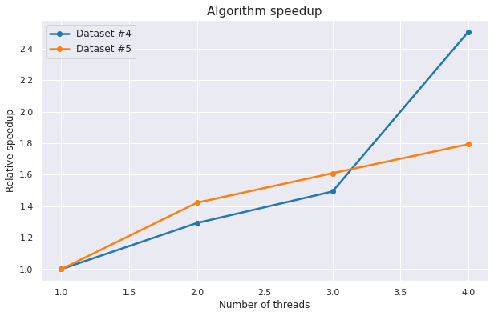

# Cluster

## Problem

Problem statement can be found [here](problem.pdf)
(English version is not available at the time of writing).

## Algorithm

Given an initial set of `K` means the algorithm proceeds by alternating 
between two steps:
1. Assignment step: assign each observation to the cluster with the nearest
   mean and to this cluster only.
1. Update step: recalculate means (centroids) for observations assigned to each
   cluster.
 
The algorithm has converged when the assignments no longer change
and is not guaranteed to find the optimum.

Clustering example for dataset 2 can be seen below.

## Implementation details

* Initial `K` cluster centroids are chosen randomly.
* Algorithm uses OpenMP's `parallel for` while assigning points to cluster.
* Recalculating new means uses the same idea while reducing by variable
  `updated` – indicator whether any centroid has moved. 
* Source code is located in [`src`](src) directory.

## Benchmarks

Measurements were taken on 3,1 GHz Dual-Core Intel Core i5 (2 cores, 4 threads with hyper-threading enabled)
in [`Release`](https://cmake.org/cmake/help/v3.18/variable/CMAKE_BUILD_TYPE.html) build.

Relative speedups for datasets 4 and 5 are shown below.  
  

## References

* https://docs.microsoft.com/en-us/cpp/parallel/openmp/openmp-in-visual-cpp?view=msvc-160

## Appendix

Contact the author if Jupyter notebooks with code for plots are needed.
