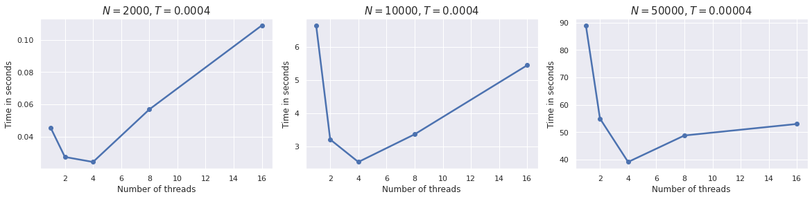

# Heat

## Problem

Problem statement can be found [here](problem.pdf)
(English version is not available at the time of writing).

## Algorithm

To solve the 1D heat equation using MPI, a form of domain decomposition is used.
Given `P` processors, interval `[0, 1]` is divided into `P`
approximately equal subintervals. Each processor can set up the stencil
equations that define the solution almost independently. The exception is that
every processor needs to receive a copy of the solution values determined for
the nodes on its immediately left and right sides.

Thus, each process uses `MPI` to send its leftmost solution value to its left
neighbor, and its rightmost solution value to its rightmost neighbor. Of course,
each process must then also receive the corresponding information that its
neighbors send to it.
(However, the first and last process only have one neighbor, and use boundary
condition information to determine the behavior of the solution at the node
which is not next to another process's node.)

Distributed approximate computation gives quite accurate solution – difference
with the exact solution is roughly `0.000010874`.

## Implementation details

* `WorldGuard` checks for solution possibility and
  [throws](https://github.com/TmLev/hpc-hw/blob/9774133ced3ed53131c70b698f1dec1adfabaf9f/3-heat/src/world-guard.cpp#L19)
  if configuration is invalid.
* Value sharing with the previous/next (w.r.t. rank) neighbours is done
  using `MPI_Send/MPI_Recv`.
* The first process collects data from other processes in the end using
  `MPI_Gatherv`.
* Source code is located in [`src`](src) directory.

## Benchmarks

Measurements were taken on 3,1 GHz Dual-Core Intel Core i5
(**2** cores, **4** threads with hyper-threading enabled) in
[`Release`](https://cmake.org/cmake/help/v3.18/variable/CMAKE_BUILD_TYPE.html)
build. There are no speedups for experiments with more than 4 threads because of
the overhead induced by context switching, OS preemptive nature, MPI's message
passing, etc.

## References

* https://www.mpich.org/static/docs/v3.3/

## Appendix

Contact the author if Jupyter notebooks with code for plots are needed.
